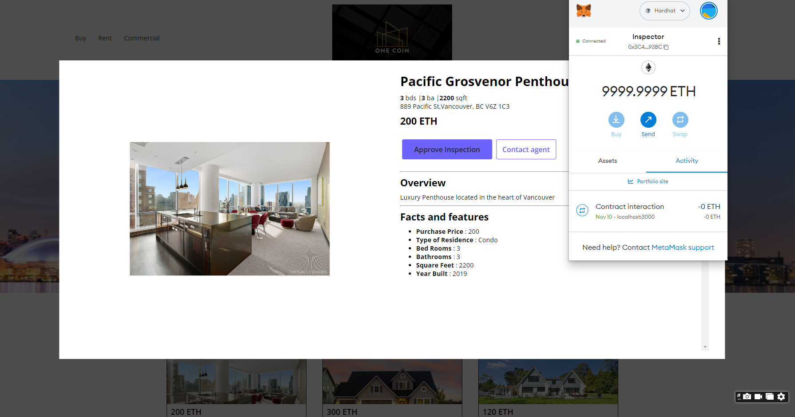
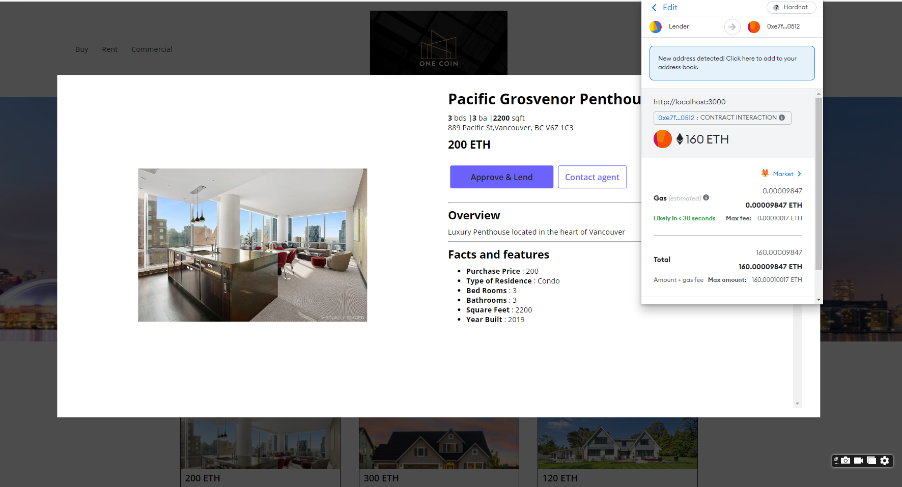

# One-Coin Realty

At One Coin-Realty we strive to accelerate the process of buying and selling properties through the medium of smart contracts and tokenization. We streamline how investors/homeowners buy and sell high quality real estate assets, while increasing  the returns for sellers.  Our platform reduces the “friction” costs incurred by industry “middlemen”.

This Project has 4 step process:

1. Convert real estate documents into a digital asset class 

2. Mint the real estate asset into a registered NFT

3. Furnish the token with legal paperwork, sales details and technical descriptions

4. Connect the token to a crypto platform for selling  (smart contracts)

### Workflow

### Evaluation Evidence

1. Connect the website to the wallet

2. Seller selects one of the property and click on Buy. Buyer needs to pay 20% down payment in Ether.

3. The Crypto Wallet "Metatmask" pops up with the buyer account and the buy transaction is initiated

4. Once the buy transaction is passed in Metamask, User Selects the Inspector Wallet address and the inspection transaction is completed.

5. After inspection, the Lender Wallet is connected to metamask and the Lender pays the remaining Mortgage in form of Ether.

6. Lastly the Seller approves the transaction and the property reflects the Buyer Address at the top.

7. The transactions are finally verified in the metamask. Buyer should see "Real" token in their Wallet.

